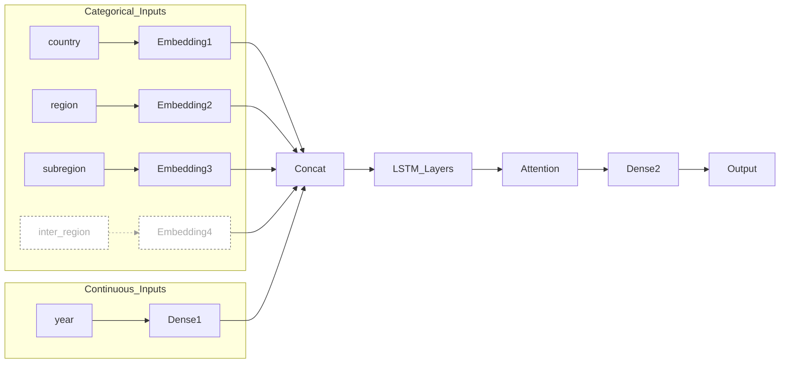
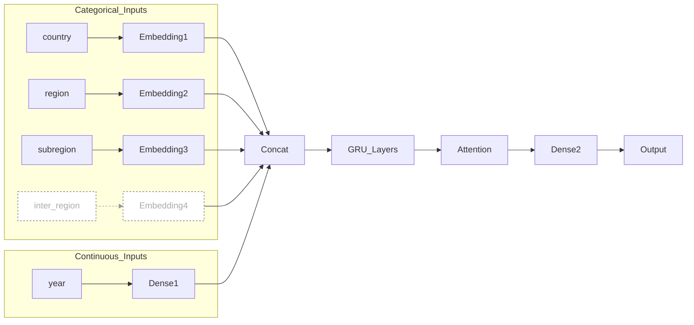
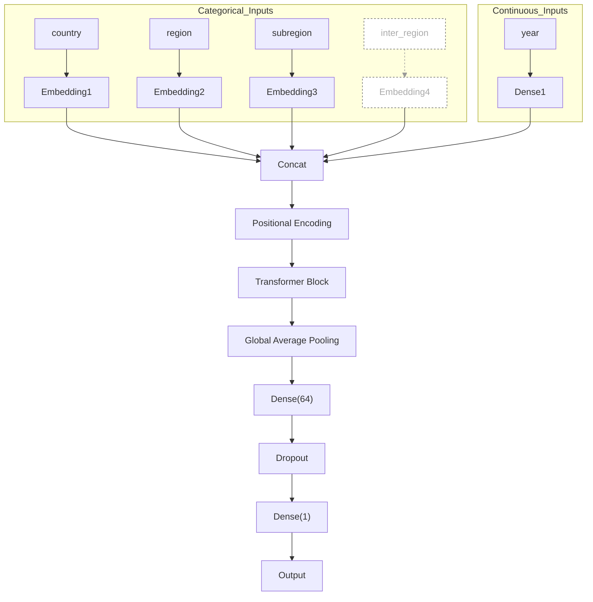

# Deep Learning：LSTM, GRU, Transformer

> ```
> .
> ├── ETSA.ipynb # Time Series Exploratory Analysis
> ├── Results (Metrics) # 模型、实验指标
> ├── gru_predict.py # GRU 模型训练代码
> ├── LSTM_predict.py # LSTM 模型训练代码
> ├── transformer_predict.py # Transformer模型训练代码
> ├── GRU_predict # GRU模型+参数
> ├── LSTM_predict # LSTM模型+参数
> ├── Transformer_predict # Transformer模型+参数
> ├── Predict_Visulization # 预测结果可视化（这里用的是"LSTM + no_inter_region +WithoutDiff")
> │   ├── Region_LSTM_Men.png
> │   └── Region_LSTM_Women.png
> └── predict_visualizaion.py # 可视化代码
> ```

## I. Abstract

因为看到kaggle上有人做的Transformer的模型，然后就用Transformer做baseline。最后输出的拟合效果：LSTM>Transformer>GRU

为了优化模型拟合的效果，做了一下时间序列模式的分析（这里是课程相关的内容，感觉可以写入report，详情见`ETSA.ipynb`）。

分析的结果是，有明显的趋势性，季节性比较微弱（所以这里没有做和季节性的实验）。

根据分析结果，对数据进行了一阶差分，最后效果是差分前后效果提升不算太大。

> [!NOTE]
>
> 这里插一句，我这边输入的特征是：`country_name, region, sub_region, year`。没有使用`inter-region`是因为缺失值有点多（7k+），而且认为填充unknown以后作为特征区别不大，所以一开始直接舍弃这个特征。
>
> 基于这个问题，后面进行了实验。

实验的时候，加入了`inter_region`，缺失值填充方式考虑了两个：

1. Unknown 填充
2. 用上一级的区域划分填充（也就是sub_region）

最后结论是，加入了sub_region后+差分，效果最佳。

## II. Time Series Exploratory Analysis

以region为单位，进行了STL Decompositio（趋势、季节性、残差分解），大概总结一下（可以挑需要的图进行分析）：

1. Trend 明显随时间单调上升  -> **做差分的原因**
2. Seasonal 部分非常微弱 -> **因此没有做季节性建模**
3. Residual（残差）相对平稳 -> **说明差分或 trend decomposition 已足够去除大部分非平稳成分**
4. ACF -> 确实是趋势性主导的特征，季节性成分弱
5. PACF 没有表现出强的周期性
6. 滑动平均 -> 各 region 走势平滑一致（就是进一步确认了趋势性）

（其实有些证明的东西都类似的，主要1-3条即可）

## III. Feature Engineering

- 特征的选择：`country_name, region, sub_region, year`
- 特征的缺失处理：也就是`intermediate-region`，一开始是没有作为输入的，实验的时候才考虑，实验的时候填充方式考虑两个
  - `Unknown` 填充
  - 用上一级的区域划分填充（也就是``sub_region`）
- 差分操作：一阶差分，具体可看代码

## IV. Model Structure

### i. LSTM

> [!IMPORTANT]
>
> 输入包括 country, region, sub_region 三个分类特征，分别通过 embedding；以及 continuous feature 输入。经过特征拼接后，采用两层 LSTM（128, 64 units），接 attention block，最后分别预测 output_women 和 output_men。

**<u>具体架构设计看keras文件，这里我用mermaid简单画一下</u>**




### ii. GRU

> [!IMPORTANT]
>
> 模型输入包含四个分类特征（country, region, subregion, inter_region），分别通过 embedding 层进行稠密化表示，同时连续特征（如年份等）通过 TimeDistributed(Dense) 进行投影。之后将 embedding 特征与连续特征进行拼接，输入到两层 GRU 网络中。为提高建模能力，引入了 attention 机制对输出序列加权求和。最后通过全连接层预测两个输出目标（output_women 和 output_men）。





### iii. Transformer

> [!IMPORTANT]
>
> 模型基于 Transformer 架构，输入为经过 Embedding 和 Position Encoding 处理的时间序列特征，之后经过标准的 Transformer Encoder Block（包含 Multi-Head Attention、FeedForward、LayerNorm），随后使用 GlobalAveragePooling 汇聚时间维度特征，接入 Dense 和 Dropout 层后输出最终的 Life Expectancy 预测。




## V. Metrics

这里loss function 我也选的是MAE，参考的是文献\[1]。

选取MAE，$R^2$作为评估指标，运用还原归一化的数据进行计算。\[1, 2]

## References

[1] Ren, Bingyu & Wu, Yingtong & Huang, Liumei & Zhang, Zhiguo & Huang, Bingsheng & Zhang, Huajie & Ma, Jinting & Li, Bing & Liu, Xukun & Wu, Guangyao & Zhang, Jian & Shen, Liming & Liu, Qiong & Ni, Jiazuan. (2021). Deep transfer learning of structural magnetic resonance imaging fused with blood parameters improves brain age prediction. Human Brain Mapping. 43. 10.1002/hbm.25748. 

[2]Bali, Vikram & Aggarwal, Deepti & Singh, Sumit & Shukla, Arpit. (2021). Life Expectancy: Prediction & Analysis using ML. 1-8. 10.1109/ICRITO51393.2021.9596123. 
