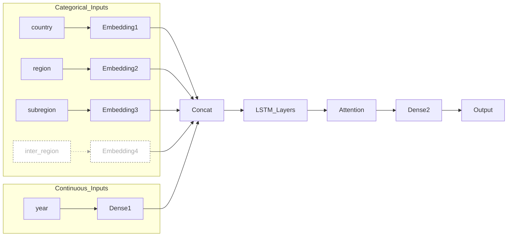
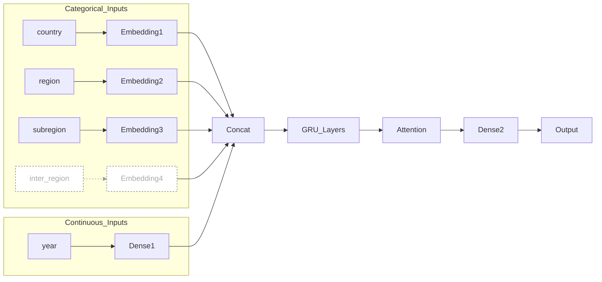
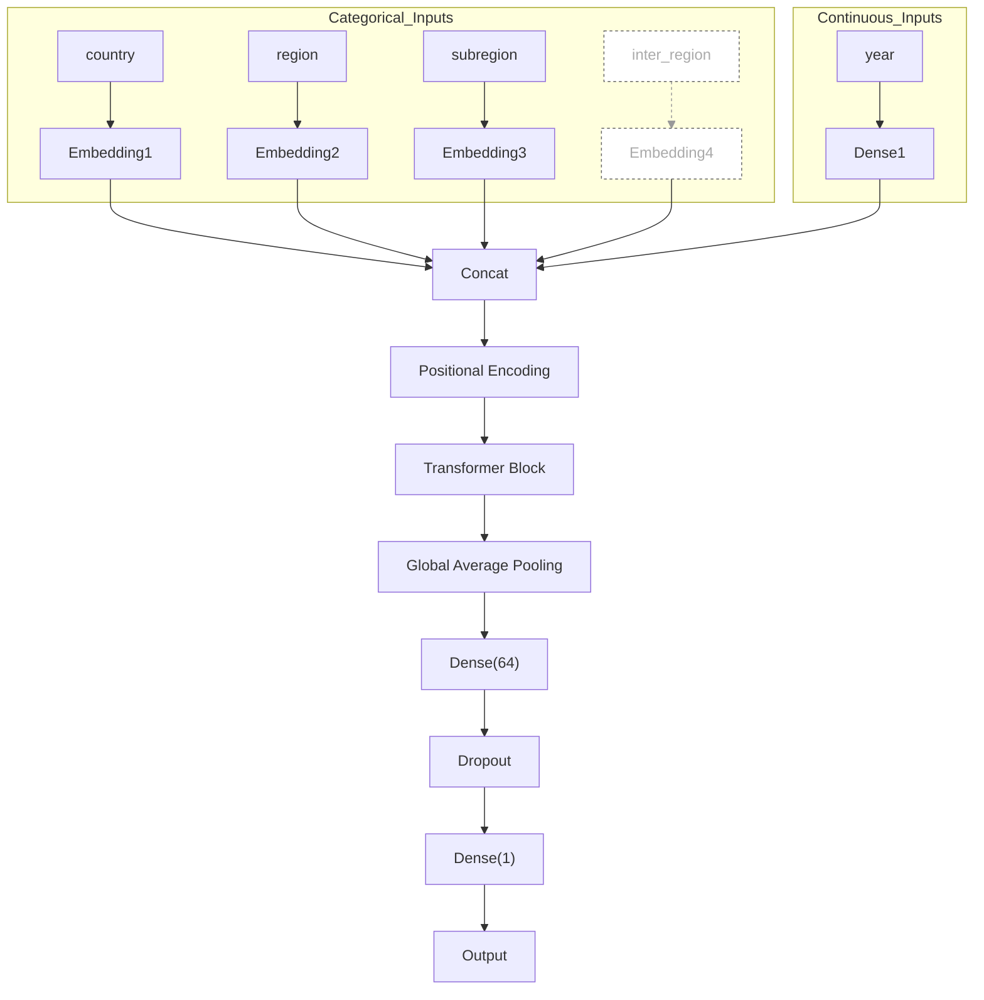

# Deep Learning：LSTM, GRU, Transformer

<!--ZHANG Zhiyin-->

> ```
> ├── ETSA.ipynb # Time Series Exploratory Analysis
> ├── Results (Metrics) # Models and Experiment Metrics
> ├── gru_predict.py # GRU Model Training Code
> ├── LSTM_predict.py # LSTM Model Training Code
> ├── transformer_predict.py # Transformer Model Training Code
> ├── GRU_predict # GRU Model + Parameters
> ├── LSTM_predict # LSTM Model + Parameters
> ├── Transformer_predict # Transformer Model + Parameters
> ├── Predict_Visualization # Prediction Result Visualization (Here, "LSTM + no_inter_region + WithoutDiff" is used)
> │   ├── Region_LSTM_Men.png
> │   └── Region_LSTM_Women.png
> └── predict_visualization.py # Visualization Code
> ```

## I. Abstract

Because I saw someone on Kaggle use a Transformer model, I decided to use Transformer as a baseline. The final fitting results are: LSTM > GRU > Transformer (here we are discussing the fitting effect, i.e., R2R_2, with Transformer having the smallest MAE).

To optimize the model fitting, a time series pattern analysis was conducted.

The analysis result showed that the time series data has a clear trend, with weak seasonality (so no experiments with seasonality were performed here).

Based on the analysis, first-order differencing was applied to the data, but the effect before and after differencing was not significantly improved.

> [!NOTE]
>
> The input features are: `country_name, region, sub_region, year`. The `inter-region` feature was not used because it had many missing values (over 7k), and it was believed that filling it with "unknown" would not significantly change the distinction of the feature. Therefore, this feature was initially discarded.
>
> Based on this issue, further experiments were conducted.

During the experiments, the `inter_region` feature was added, and two methods for handling missing values were considered:

1. Fill with **"Unknown"**
2. Fill with the higher-level region  `sub_region`

The final conclusion was that, after adding the `inter_region` and applying differencing, the best results were achieved with LSTM.

## II. Time Series Exploratory Analysis

Here’s a summary of the STL Decomposition (Trend, Seasonal, Residual) for each region, with insights drawn from the analysis:

1. **Trend**: Clearly shows a monotonous upward movement over time -> **Reason for differencing**.
2. **Seasonal**: The seasonal component is very weak -> **Therefore, no seasonal modeling was performed**.
3. **Residual**: The residuals are relatively stable -> **This indicates that differencing or trend decomposition has effectively removed most of the non-stationary components**.
6. **Moving Average**: The trends for each region are smooth and consistent -> **This further confirms the presence of trend dominance**.

This analysis helps justify the approach of focusing on trend modeling and differencing, rather than seasonality modeling.

## III. Feature Engineering

- **Feature Selection**: `country_name, region, sub_region, year`
- **Missing Data Handling**: The `intermediate-region` feature was initially not included as an input. During experimentation, two strategies for handling missing values were considered:
  - Fill with "Unknown"
  - Fill with the next higher-level region division (i.e., `sub_region`)
- **Differencing**: First-order differencing was applied. The specific implementation can be found in the code.

## IV. Model Structure

### i. LSTM

> [!IMPORTANT]
>
> The input includes three categorical features: `country`, `region`, and `sub_region`, which are processed through embeddings. Along with these, continuous features are also included as inputs. After concatenating the features, the model utilizes two layers of LSTM (with 128 and 64 units, respectively), followed by an attention block. Finally, the model predicts two separate outputs: `output_women` and `output_men`.

**<u>具体架构设计看keras文件，这里我用mermaid简单画一下</u>**




### ii. GRU

> [!IMPORTANT]
>
> The model input includes four categorical features (`country`, `region`, `sub_region`, `inter_region`), each processed through an embedding layer for dense representation. Continuous features (such as the year) are projected using a `TimeDistributed(Dense)` layer. Afterward, the embedding features and continuous features are concatenated and fed into a two-layer GRU network.
>
> To enhance the model's ability to capture important features, an attention mechanism is introduced to apply weighted summation to the output sequence. Finally, the model uses a fully connected layer to predict two output targets: `output_women` and `output_men`.




### iii. Transformer

> [!IMPORTANT]
>
> The model is based on the Transformer architecture. The input consists of time series features that are processed through Embedding and Position Encoding. Then, the data passes through the standard Transformer Encoder Block, which includes Multi-Head Attention, FeedForward layers, and LayerNorm.
>
> Afterward, GlobalAveragePooling is applied to aggregate the time dimension features. The resulting features are then passed through Dense and Dropout layers before outputting the final prediction for Life Expectancy.




## V. Metrics

The loss function I chose is MAE, following the approach from the literature [1].

MAE and $R^2$ are selected as evaluation metrics, and the calculations are done using the data that has been reversed from normalization [1, 2].

## References

[1] Ren, Bingyu & Wu, Yingtong & Huang, Liumei & Zhang, Zhiguo & Huang, Bingsheng & Zhang, Huajie & Ma, Jinting & Li, Bing & Liu, Xukun & Wu, Guangyao & Zhang, Jian & Shen, Liming & Liu, Qiong & Ni, Jiazuan. (2021). Deep transfer learning of structural magnetic resonance imaging fused with blood parameters improves brain age prediction. Human Brain Mapping. 43. 10.1002/hbm.25748. 

[2]Bali, Vikram & Aggarwal, Deepti & Singh, Sumit & Shukla, Arpit. (2021). Life Expectancy: Prediction & Analysis using ML. 1-8. 10.1109/ICRITO51393.2021.9596123. 
